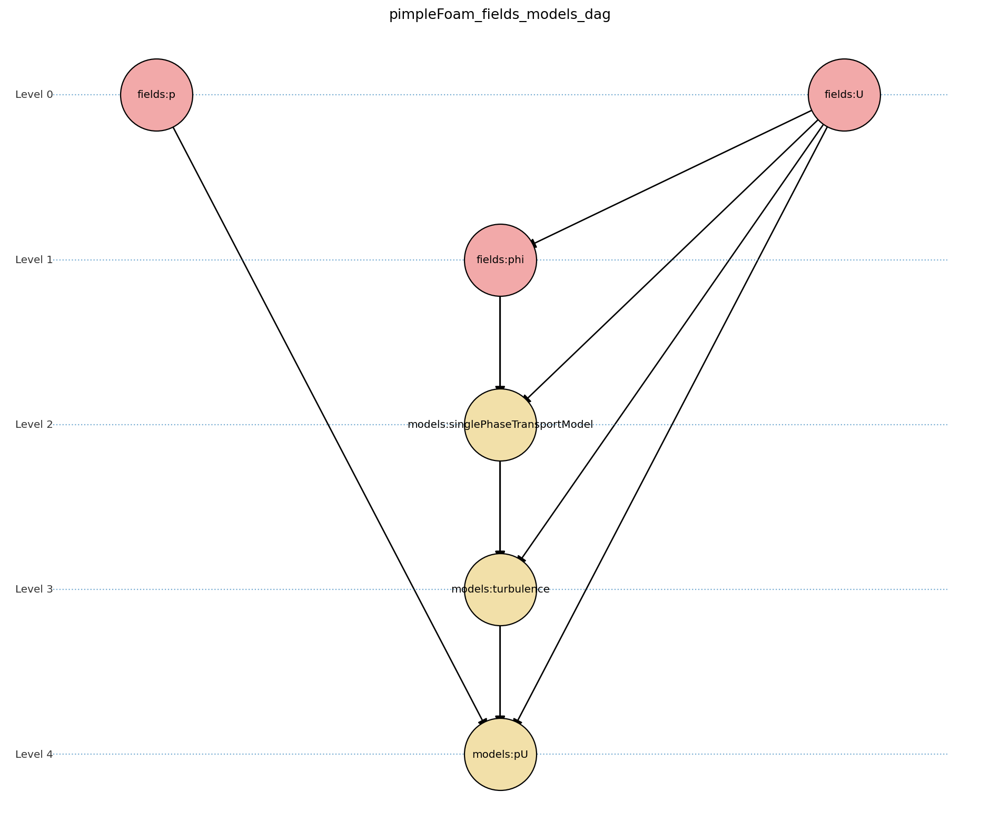

Overview
========

Architecture
------------

This document describes the overall architecture of FoamAdapter, including both the C++ core and Python interface components.

FoamAdapter is designed as a multi-layered architecture that bridges OpenFOAM and NeoN computational backends while providing both C++ and Python interfaces.

Solver Workflows
----------------

FoamAdapter supports different types of solvers, each with their specific computational steps and algorithms. The following diagram illustrates the workflow for two common solver types for a conjugate heat transfer scenario:

.. mermaid::

    %%{init: {'flowchart': { 'htmlLabels': true, 'wrap': true }}}%%
    flowchart TB
        subgraph setup1 ["setup "]
            direction TB
            S1A["Initialize Fields"]
        end

        subgraph setup2 ["setup"]
            direction TB
            S2A["Initialize Temperature Field"]
        end

        subgraph S1 ["non-thermal-fluid solver"]
            direction TB
            S1C["Momentum Predictor"]
            S1C --> S1E["Solve Energy Equation"]
            S1E --> S1F["Pressure Corrector PISO Loop"]
            S1F --> S1J["Update turbulence Model"]
        end

        subgraph S2 ["thermal-solid solver"]
            direction TB
            S2B["Solve Energy Equation"] --> S2D["Update Solid Properties"]
        end

        setup1 --> S1C
        setup2 --> S2B
        S1E --> S2B
        S2B --> S1E

The diagram shows two solver workflows: a non-thermal-fluid solver and a thermal-solid solver. Each solver has its own setup phase and computational steps, with interactions between the two solvers for energy exchange.

The solvers are built modularly, allowing for easy extension and customization of individual components.

.. note::

    The solution procedure is only known at runtime, and a DAG needs to be solved to determine the correct order of operations. Which is not implemented yet

Modular Solver Architecture
---------------------------

FoamAdapter implements a modular architecture where core solver steps can be extended with additional physics modules. This allows for flexible composition of complex multi-physics simulations:

.. mermaid::

   flowchart TD
        
        subgraph MAIN ["Main Solver Loop"]
            STEP1["Momentum Predictor Solve velocity equation"]
            STEP2["Additional Physics Modules"]
            STEP3["Pressure Corrector Ensure mass conservation"]
            STEP4["Field Updates Correct U, φ, turbulence"]
        end
        
        STEP1 --> STEP2
        STEP2 --> STEP3
        STEP3 --> STEP4
        
        %% Physics Extensions (simplified)
        subgraph AddPhysics ["Additional Physics Modules"]
            direction TB
            POROSITY["Porosity"]
            ROTATION["Rotating Reference Frame"]
            BUOYANCY["Boussinesq Approximation"]
        end
        POROSITY -.-> STEP1
        ROTATION -.-> STEP1
        BUOYANCY -.-> STEP2
        BUOYANCY -.-> STEP3

        style MAIN fill:#E3F2FD
        style AddPhysics fill:#E3F2FD
        style STEP1 fill:#2196F3,color:#fff
        style STEP2 fill:#FF9800,color:#fff
        style STEP3 fill:#9C27B0,color:#fff
        style STEP4 fill:#607D8B,color:#fff

In this architecture, the main solver loop consists of core steps such as momentum prediction and pressure correction. Additional physics modules (e.g., porosity, rotation, buoyancy) can be plugged into the workflow to modify the behavior of these core steps.

This modular design enables users to easily add or remove physics effects without altering the fundamental solver structure, promoting code reuse and maintainability.

.. note::

    Not implemented yet

Field and Model Initialization
------------------------------

As the fields and solver needs to be initialized before the solver run, FoamAdapter provides a structured initialization phase to ensure that the necessary fields and models are properly set up.

The fields and models are stored lazily at first with the dependencies and a DAG is solved to determine the correct initialization order.

The following code snippet illustrates how a turbulence model and a derived field (face velocity) are defined with their dependencies:

.. code-block:: python

    class TurbulenceModel:
    
    
        @property
        def dependencies(self) -> list[str]:
            return ["U", "phi", "singlePhaseTransportModel"]
        
        @property
        def description(self) -> str:
            return "Incompressible turbulence model"
        
        def __call__(self, deps: dict):
            U = fields.get_field(deps, "U")
            phi = fields.get_field(deps, "phi")
            singlePhaseTransportModel = models.get_model(deps, "singlePhaseTransportModel")
            turbulence = incompressibleTurbulenceModel.New(U, phi, singlePhaseTransportModel)
            return turbulence

    @fields.Fields.deps("U")
    def create_face_velocity(deps: dict) -> surfaceScalarField:
        U = fields.get_field(deps, "U")
        phi_field = createPhi(U)
        return surfaceScalarField(
            value=phi_field,
            dimensions=(0, 1, -1, 0, 0, 0, 0),
            description="Face flux field",
        )

The same approach is used for all fields and models in FoamAdapter, ensuring a consistent and reliable initialization process.

Plugin Architecture
-------------------

Motivation
^^^^^^^^^^

Modern scientific and engineering workflows require flexible simulation frameworks that can be easily extended and customized. FoamAdapter's plugin architecture is designed to enable users and developers to add new physics models, boundary conditions, and solver modules without modifying the core codebase. This approach promotes maintainability, collaboration, and rapid prototyping of new features.

Concept
^^^^^^^
FoamAdapter implements a runtime-extensible plugin/config system using Pydantic discriminated unions and a registry pattern. The core idea is to allow new plugin types (e.g., models, fields, solvers) to be registered dynamically, either at runtime or via Python entry points (setuptools).
Each plugin type (such as physics models or boundary conditions) is managed by a registry, which collects all available plugin classes and exposes a unified configuration model for input validation and schema generation.

**Background: Pydantic Discriminated Unions**

Pydantic supports discriminated unions for type-safe configuration, but the set of types in the union must be known at model definition time. For example:

.. code-block:: python

    from typing import Literal, Union
    from pydantic import BaseModel, Field

    class Cat(BaseModel):
        pet_type: Literal['cat']
        meows: int

    class Dog(BaseModel):
        pet_type: Literal['dog']
        barks: float

    class Lizard(BaseModel):
        pet_type: Literal['reptile', 'lizard']
        scales: bool

    class Model(BaseModel):
        pet: Union[Cat, Dog, Lizard] = Field(discriminator='pet_type')
        n: int

This works well for static unions, but it is not possible to add new types to the union at runtime. This is a challenge for plugin systems, where extensibility is required.

**How FoamAdapter Solves This**

Plugins are registered using a decorator-based API, making it easy for users to define and integrate new modules. Whenever a new plugin is registered, the system automatically rebuilds the Pydantic model for the plugin type, updating the discriminated union to include all registered types. This means that the configuration model always reflects the current set of available plugins, and input validation is always up to date.

For example, after registering a new shape plugin, you can immediately use the updated model for validation:

.. code-block:: python

    ShapeBase.register(TriangleConfig)
    shape = ShapeBase.plugin_model(shape={"shape_type": "triangle", "base": 3.0, "height": 4.0}, color="yellow")

This dynamic rebuilding of the model enables true runtime extensibility and ensures that input validation and schema generation always match the available plugins. The `plugin_model` attribute needs to be called to obtain the up-to-date model for the plugin type.

Usage
^^^^^
To add a new plugin, users simply define a new Python class for their model or field and register it with the appropriate base class:

.. code-block:: python

    from foamadapter.core.plugin_system import PluginSystem

    @PluginSystem.register(discriminator_variable="model", discriminator="model_type")
    class ModelBase(BaseModel):
        name: str

    @ModelBase.register
    class MyCustomModel(BaseModel):
        model_type: Literal["custom"]
        parameter: float

    # Instantiate a model config
    config = ModelBase.create(model={"model_type": "custom", "parameter": 1.23}, name="example")

Plugins can also be discovered and registered automatically via Python entry points, allowing third-party packages to extend FoamAdapter seamlessly. The unified configuration model and schema make it easy to build UIs, validate inputs, and document available plugins.

Model Availability 
------------------

Model configuration and validation in FoamAdapter is built on top of Pydantic, which natively supports input validation and automatic JSON schema generation for all models.
This is a standard feature of Pydantic and enables:

* building a UI on top of FoamAdapter
* input validation
* documentation of available models
* the usage of generative AI tools
* meta data generation

For any Pydantic model (including plugin/config models), you can obtain the JSON schema for validation and UI generation as follows:

.. code-block:: python

    # Given a registered plugin/config model
    schema = ShapeBase.plugin_model.model_json_schema()
    # Or for any Pydantic model:
    schema = MyModel.model_json_schema()

This makes it easy to discover available fields, types, and constraints for all models in the library.

